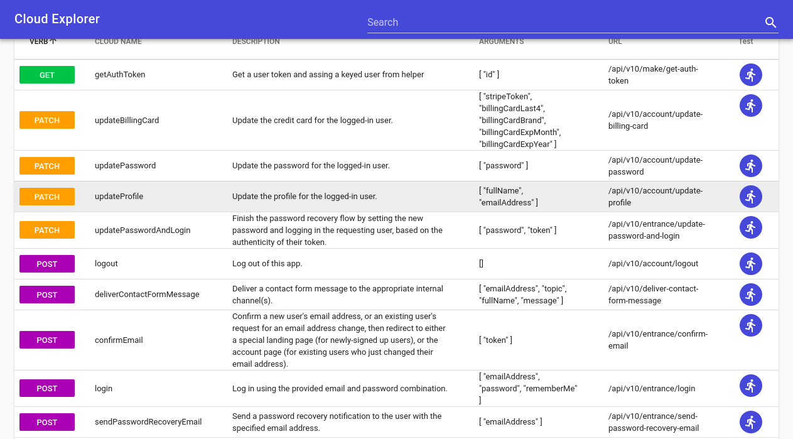

# sails-hook-cloud

## Screenshot



Automate your actions in one place, routes are generated automatically just like how `nuxt` generates the routes but for server

## Installing

I recommend <a href="https://pnpm.js.org/">pnpm</a>, so..

```sh
$ pnpm i sails-hook-cloud
```

create `config/cloud.js` file

```js
module.exports.cloud = {
  proxy: '/api/v1/anything-at-all'
};
```

this proxy would be used to add a route prefix to the main routes

> This hook tends to generate automatic routes from your controllers/actions and binds them to sails without you manually creating them in the `config/routes.js`

## Usage

while you can access the `API` endpoints directly, you can also use the cloud sdk client to automatically communicate with the server, the sdk is still in development but can be accessed <a href="https://github.com/navicstein/cloud-sdk">here</a>

visit http://locahost:1337/__cloud to view your actions in an explorer (you should have internet connection for the first time)

contributions and suggestions are higly welcomed
